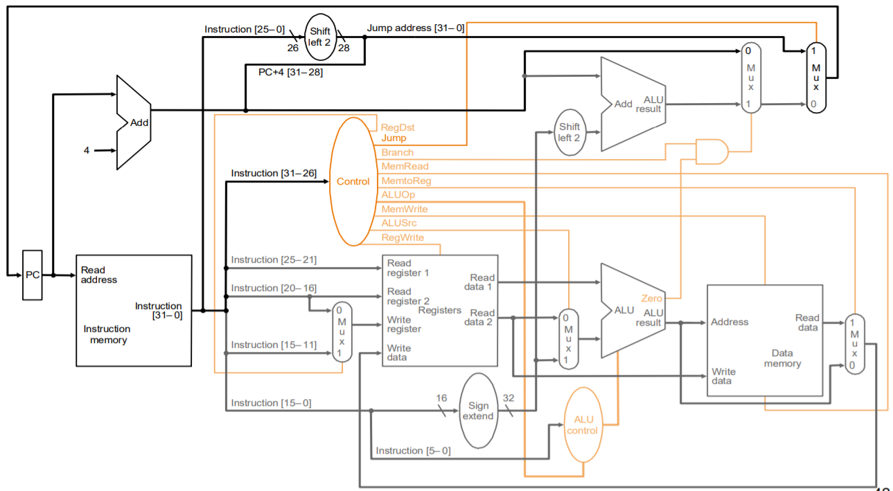

# MIPS Processor - Metronome

## 👥 Membros da equipe:
   * Arthur Ferreira Pompilio </~afp> ([scrrpfv](https://github.com/scrrpfv))
   * Ennaly </~e> ([usergithub](https://github.com/))
   * Fernanda Marques Neves </~fmn> ([fiefaneves](https://github.com/fiefaneves))
   * Lucas Guimarães Fernandes </~lgf> ([CS-LucasGuimaraes](https://github.com/CS-LucasGuimaraes))
   * Tomé da Costa Lima </~tcl> ([tomclima](https://github.com/tomclima))

## 🎯 Índice

- [👥 Membros da equipe](#-Membros-da-equipe)
- [📋 Divisão de tarefas](#-Divisão-de-tarefas)
- [👨🏻‍💻 Organização do código](#-Organização-do-código)

 

## 📋 Divisão de tarefas

|       Equipe        | Tarefas |
| ------------------- | ------- |
| **Arthur Pompilio** | Funcionamento da ALU; Módulo de registradores;Testes unitários dos módulos; Programa em Assembly;     |
| **Ennaly**          | Programa em Assembly; |
| **Fernanda Neves**  | Memórias de intrução; Memórias de dados; Organização do repositório; Programa em Assembly; |
| **Lucas Guimarães** | Módulo processor, que une os outros módulos; Módulo dos registradores; Transpilação para binário; Testes e Debug do processador final; Funcionamento do JAL; Programa em Assembly; |
| **Tomé da Costa Lima**            | Módulo control; Macros de instruções; Testes unitários dos módulos; Debug do programa no processador final; Funcionamendo do JAL; Programa em Assembly; |

## 👨🏻‍💻 Organização do código

#### **A organização do código é composta por diversas partes, sendo as principais**:
- **main.cpp**:
Programa em C++, que recebe um inteiro x (0 ou 1), o qual define a frequência do metrônomo e um inteiro k, que define quantos segundos deve ser rodado o código.
Demonstração do que o programa em assembly e binário fará.

- **main.asm**:
Programa transcrito para Assembly, que carrega os valores da memória a partir da instrução 'lw' e também armazena valores na memória com a 'sw'. A 'addi' carrega os valores armazenados em memória em variáveis. Além disso, fez-se o uso da instrução 'bne', a qual pula para uma label estipulada, caso os dois valores comparados sejam diferentes. Por fim, instrução 'jal' que faz jumps no código para label desejada e 'jr' que retorna pra posição que a label foi chamada anteriormente.

- **main.bin**:
Transpilação do programa em assembly para binário.

|     Instrunction      | PC code | Binarie 1 | Binarie 2 | Binarie 3 | Binarie 4 |            Command             |
| :-------------------: | :-----: | :-------: | :-------: | :-------: | :-------: | :----------------------------: |
|          00           |   00    | 00001100  | 00000000  | 00000000  | 00000101  |            jal main            |
|       **wait:**       | ~~04~~  |           |           |           |           |                                |
|          01           |   04    | 00100000  | 00001001  | 00000000  | 00000000  |        addi $t1, $0, 0         |
| **while_wait_begin:** |   08    |           |           |           |           |                                |
|          02           |   08    | 00100001  | 00101001  | 00000000  | 00000001  |        addi $t1, $t1, 1        |
|          03           |   12    | 00010101  | 00100100  | 00000000  | 00000100  | bne $t1, $a0, while_wait_begin |
|          04           |   16    | 00000011  | 11100000  | 00000000  | 00001000  |             jr $ra             |
|           -           | ~~20~~  | **main:** |           |           |           |                                |
|          05           |   20    | 10001100  | 00010000  | 00000000  | 00000000  |         lw $s0, 0($0)          |
|          06           |   24    | 10001100  | 00010001  | 00000000  | 00000100  |         lw $s1, 4($0)          |
|          07           |   28    | 00100000  | 00001000  | 00000000  | 00000000  |        addi $t0, $0, 0         |
| **while_main_begin:** | ~~32~~  |           |           |           |           |                                |
|  **if_main_begin:**   | ~~32~~  |           |           |           |           |                                |
|          08           |   32    | 00010110  | 00000000  | 00000000  | 00001100  |  bne $s0, $0, else_main_begin  |
|          09           |   36    | 00100000  | 00000100  | 00000000  | 00001010  |          $a0, $0, 10           |
|          10           |   40    | 00001100  | 00000000  | 00000000  | 00000001  |            jal wait            |
|          11           |   44    | 00001100  | 00000000  | 00000000  | 00001110  |      jal if_else_main_end      |
| **else_main_begin:**  | ~~48~~  |           |           |           |           |                                |
|          12           |   48    | 00100000  | 00000100  | 00000000  | 00010100  |        addi $a0, $0, 20        |
|          13           |   52    | 00001100  | 00000000  | 00000000  | 00000001  |            jal wait            |
| **if_else_main_end:** | ~~56~~  |           |           |           |           |                                |
|          14           |   56    | 00100001  | 00001000  | 00000000  | 00000001  |        addi $t0, $t0, 1        |
|          15           |   60    | 10101100  | 00001000  | 00000000  | 00001000  |         sw $t0, 8($0)          |
|          16           |   64    | 00010101  | 00010001  | 00000000  | 00001000  | bne $t0, $s1, while_main_begin |

- **alu.sv**:
Modulo combinacional responsável por realizar operações lógicas e aritméticas básicas. O ALU recebe a operação que será realizada, além de dois valores numéricos de 32 bits, e retorna o resultado da operação com base no código que foi recebido. Também retorna uma variável "zero" que indica se esse resultado é igual a 0, e esse valor é utilizado para realizar a operação jal.

- **memory.sv**:
Lida com as memórias de dados e memórias de instruções em dois módulos separadas. A memória de dados recebe um endereço de leitura ou escrita, um sinal para habilitar a escrita e o dado que deve ser escrito, e tem como saída a leitura do dado naquele endereço. Já a memória de instruções tem apenas saída, recebendo um enderenço e retornando a instrução armazenada previamente naquele endereço.

-  **processor.sv**: 
Base do processador. Instancia todos os cabos, registradores e módulos necessários para o funcionamento do processador como um todo.

- **register.sv**:
Instanciação e funcinamento dos 32 registradores base da arquitetura mips. Recebe endereços de leitura e escrita, sinais de habilitação de escrita e retorna os dados que estão armazenados nos registradores em questão.

- **mips.codes.sv**:
Alguns macros para simplificação do projeto, contendo os códigos em binários (OPCodes e Functs) das instruções da arquitetura MIPS.

- **control.sv**:
Módulo que recebe um clock, instruction e funct e retorna qual a instrução que será executada com base nos outputs. Age com a FSM principal do processador que define os sinais a serem enviados para os modulos de acordo com a instrução recebida.

- **full.sv**:
União de todos os outros módulos, servindo para facilitar o teste em plataformas que só aceitam um arquivo de design.

- **testbench.sv**:
Testbench do processador, que carrega alguns dados na memória de dados, carrega o programa na memória de intruções, reseta o processador, executa o programa e imprimi alterações realizadas na memória de dados pelo programa carregado.